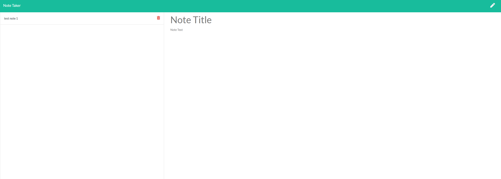

Note Taker Application (Week 11 Homework)

## User Story

AS A user, I want to be able to write and save notes

I WANT to be able to delete notes I've written before

SO THAT I can organize my thoughts and keep track of tasks I need to complete

## Business Context

For users that need to keep track of a lot of information, it's easy to forget or be unable to recall something important. Being able to take persistent notes allows users to have written information available when needed.

## Acceptance Criteria

Application should allow users to create and save notes.

Application should allow users to view previously saved notes.

Application should allow users to delete previously saved notes.

### Usage

Page the user sees when first visiting the website.

Home page after the user clicks on "Get Started."

After title and text is filled out, click save on the top right.

User can create multiple notes.

User can then view the notes by clicking on the note on the left pane.

User can also delete a note by clicking on the trash icon on the right side of the note.
